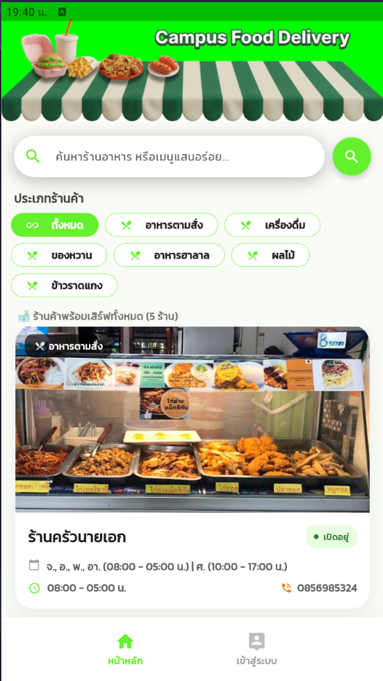
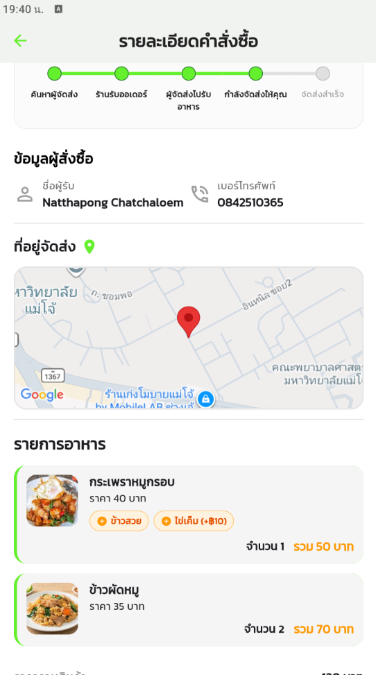
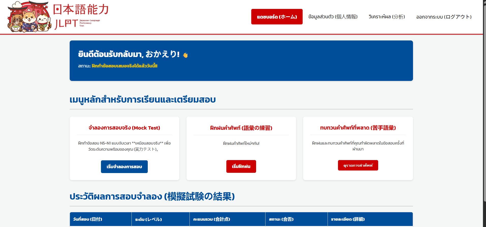
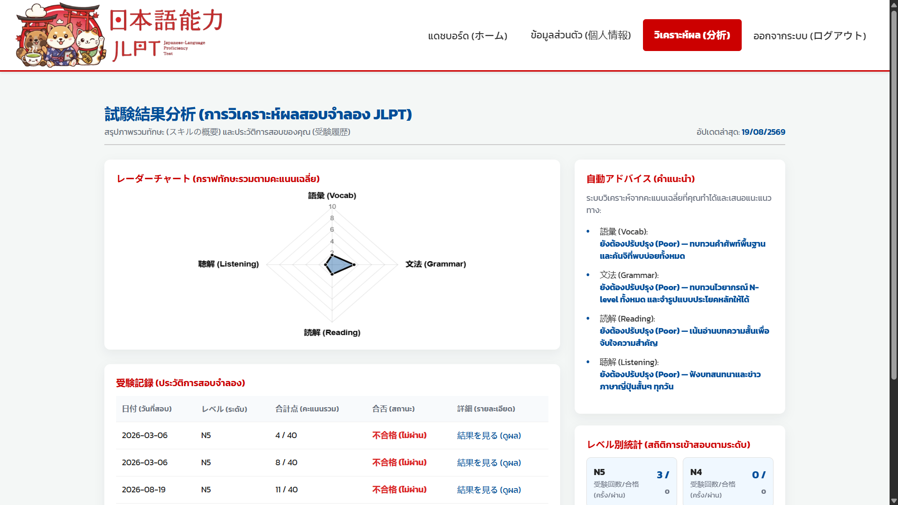
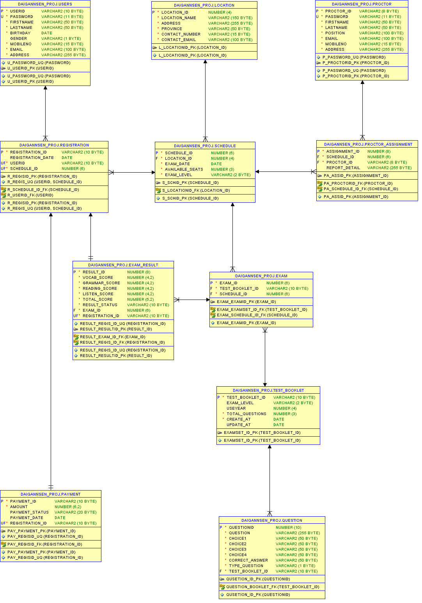

<h1 align="center">
  Hi, I’m Natthapong Chatchaloem 
  
</h1>

  <strong>I'm Student IT in Maejo University</strong> 
  <em>“create and Develop Website & Mobile”</em>

---

## 🚀 About Me
- 🌱  I’m currently learning **⟪Dart / Flutter⟫**  
- 🛠  Daily driver stack: **⟪JAVA / Springboot⟫**  
- 🎯  2026 Goal: **⟪ Full-Stack Developer ⟫**  
- 📫  Reach me: **⟪natthapong.dev9148@gmail.com⟫**

---

## 🧰 Tech Stack & Tools

| Domain | Primary / Proficient | Comfortable | Currently Exploring |
|--------|----------------------|-------------|---------------------|
| Front-end & Mobile |   |   |  |
| Back-end & APIs |   |   | |
| Databases & BaaS |  |   |   |
| DevOps & Tools |   |  |  |

---

## 📌 Featured Projects

<table>
<!-- ==================== Table Header ==================== -->
<tr style="vertical-align: top;">
  <th width="37%">Project</th>
  <th width="14%">Tech</th>
  <th width="35%">Key Features</th>
  <th width="14%">Links</th>
</tr>

<!-- ==================== Project 1 ==================== -->
<tr style="vertical-align: top;">
  <td style="vertical-align: top; text-align: center;">
    
🛵 <strong>Campus Food Delivery</strong>

     
    

      <!-- คลิกเพื่อดูรูปใหญ่ -->
      
      
    

    
🔍 Click image to enlarge

  </td>
  <td style="vertical-align: top;">
     
     
     
     
    
  </td>
  <td style="vertical-align: top;">
    👥 <strong>Duo Project</strong>
     
    <em style="font-size:0.85em; color:#9ca3af;">Mobile Application</em> 
    🍱 <strong>Campus Food Delivery System</strong>
    
Developed a cross-platform mobile application to streamline campus food ordering, reducing travel time and improving food service accessibility for students and faculty.

    <ul>
      <li>Multi-role architecture (User, Member, Restaurants, Rider, Admin)</li>
      <li>Real-time order status tracking</li>
      <li>Menu, cart, and order management</li>
      <li>RESTful APIs and secure PostgreSQL database backend</li>
    </ul>
  </td>
  <td style="vertical-align: top; text-align: center; padding: 12px 8px;">
    <a href="https://github.com/NC-Kaito/campus-food-delivery"
       style="
         display: inline-block;
         background-color: #181717;
         color: #ffffff;
         text-decoration: none;
         font-size: 13px;
         font-weight: 600;
         padding: 8px 14px;
         border-radius: 6px;
         white-space: nowrap;
         margin-bottom: 8px;
       ">
      🔗 View Repo
    </a>
     
    <a href="https://github.com/NC-Kaito/campus-food-delivery/blob/main/SRS_%E0%B8%A3%E0%B8%B0%E0%B8%9A%E0%B8%9A%E0%B8%88%E0%B8%B1%E0%B8%94%E0%B8%AA%E0%B9%88%E0%B8%87%E0%B8%AD%E0%B8%B2%E0%B8%AB%E0%B8%B2%E0%B8%A3%E0%B8%A3%E0%B9%89%E0%B8%B2%E0%B8%99%E0%B8%84%E0%B9%89%E0%B8%B2%E0%B8%A0%E0%B8%B2%E0%B8%A2%E0%B9%83%E0%B8%99%E0%B8%A1%E0%B8%AB%E0%B8%B2%E0%B8%A7%E0%B8%B4%E0%B8%97%E0%B8%A2%E0%B8%B2%E0%B8%A5%E0%B8%B1%E0%B8%A2%E0%B9%81%E0%B8%A1%E0%B9%88%E0%B9%82%E0%B8%88%E0%B9%89.pdf"
       style="
         display: inline-block;
         background-color: #24292e;
         color: #ffffff;
         text-decoration: none;
         font-size: 13px;
         font-weight: 600;
         padding: 8px 14px;
         border-radius: 6px;
         white-space: nowrap;
       ">
      📄 View SRS
    </a>
  </td>
</tr>

<!-- ==================== Project 2 ==================== -->
<tr style="vertical-align: top;">
  <td style="vertical-align: top; text-align: center;">
    
🇯🇵 <strong>Japanese-Language Proficiency Test</strong>

     
    

      <!-- คลิกเพื่อดูรูปใหญ่ -->
      
      
    

    
🔍 Click image to enlarge

  </td>
  <td style="vertical-align: top;">
     
     
     
    
  </td>
  <td style="vertical-align: top;">
    👥 <strong>Duo Project</strong>
     
    <em style="font-size:0.85em; color:#9ca3af;">Web Application</em> 
    📝 <strong>JLPT Online Practice Platform</strong>
    
A web platform for Japanese language learning, mock testing, and proficiency assessment.

    <ul>
      <li>Interactive JLPT practice tests and mock exams</li>
      <li>Automated scoring and test performance analytics</li>
    </ul>
  </td>
  <td style="vertical-align: top; text-align: center; padding: 12px 8px;">
    <a href="https://github.com/NC-Kaito/jlpt-web-project"
       style="
         display: inline-block;
         background-color: #181717;
         color: #ffffff;
         text-decoration: none;
         font-size: 13px;
         font-weight: 600;
         padding: 8px 14px;
         border-radius: 6px;
         white-space: nowrap;
       ">
      🔗 View Repo
    </a>
  </td>
</tr>

<!-- ==================== Project 3 ==================== -->
<tr style="vertical-align: top;">
  <td style="vertical-align: top; text-align: center;">
    
🗄️ <strong>JLPT Exam Management Database Programming</strong>

     
    

      <!-- คลิกเพื่อดูรูปใหญ่ -->
      
    

    
🔍 Click image to enlarge

  </td>
  <td style="vertical-align: top;">
     
     
    
  </td>
  <td style="vertical-align: top;">
    🎓 <strong>Academic Coursework Project</strong>
     
    <em style="font-size:0.85em; color:#9ca3af;">Database Systems & Data Modeling</em> 
    📊 <strong>Relational Database Design with Oracle</strong>
    
A relational database schema designed for an exam registration, proctor scheduling, and score management system.

    <ul>
      <li>Entity-Relationship (ER) modeling and comprehensive schema analysis</li>
      <li>Relational table mapping with Primary Keys, Foreign Keys, and Unique Constraints</li>
      <li>Normalization (1NF–3NF) ensuring data integrity across Users, Schedules, Exams, and Payments</li>
    </ul>
  </td>
  <td style="vertical-align: top; text-align: center; padding: 12px 8px;">
    <a href="https://github.com/NC-Kaito/project-database-jlpt-system"
       style="
         display: inline-block;
         background-color: #181717;
         color: #ffffff;
         text-decoration: none;
         font-size: 13px;
         font-weight: 600;
         padding: 8px 14px;
         border-radius: 6px;
         white-space: nowrap;
       ">
      🔗 View Repo
    </a>
    <a href="https://github.com/NC-Kaito/project-database-jlpt-system/blob/main/%E0%B8%A3%E0%B8%B0%E0%B8%9A%E0%B8%9A%E0%B8%90%E0%B8%B2%E0%B8%99%E0%B8%82%E0%B9%89%E0%B8%AD%E0%B8%A1%E0%B8%B9%E0%B8%A5%E0%B8%81%E0%B8%B2%E0%B8%A3%E0%B8%AA%E0%B8%AD%E0%B8%9A%E0%B8%A7%E0%B8%B1%E0%B8%94%E0%B8%A3%E0%B8%B0%E0%B8%94%E0%B8%B1%E0%B8%9A%E0%B8%A0%E0%B8%B2%E0%B8%A9%E0%B8%B2%E0%B8%8D%E0%B8%B5%E0%B9%88%E0%B8%9B%E0%B8%B8%E0%B9%88%E0%B8%99%20JLPT.pdf"
       style="
         display: inline-block;
         background-color: #181717;
         color: #ffffff;
         text-decoration: none;
         font-size: 13px;
         font-weight: 600;
         padding: 8px 14px;
         border-radius: 6px;
         white-space: nowrap;
       ">
      🔗 View Document
    </a>
  </td>
</tr>
</table>
## 📈 GitHub Stats

  
  

---

## 🤝 Let’s Connect Me

- 💌 Email: ⟪natthapong.dev9148@gmail.com⟫  
- 🐦 DM me on [Facebook](https://www.facebook.com/natthapong.chatchaloem)

  

